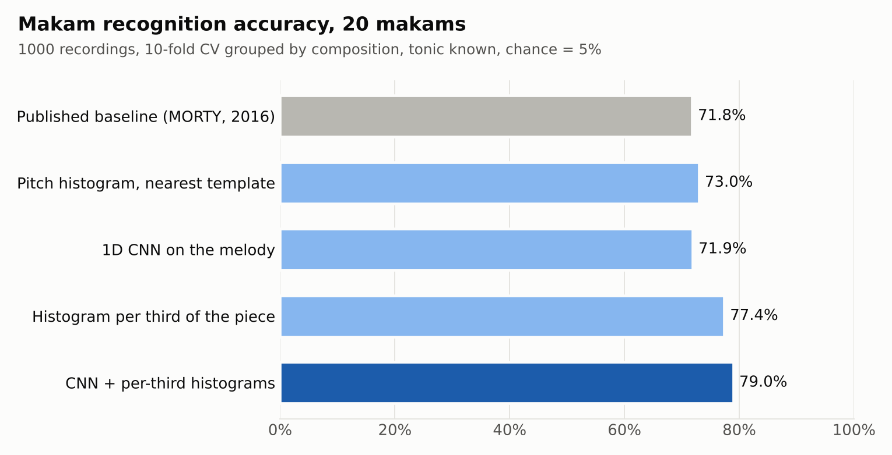
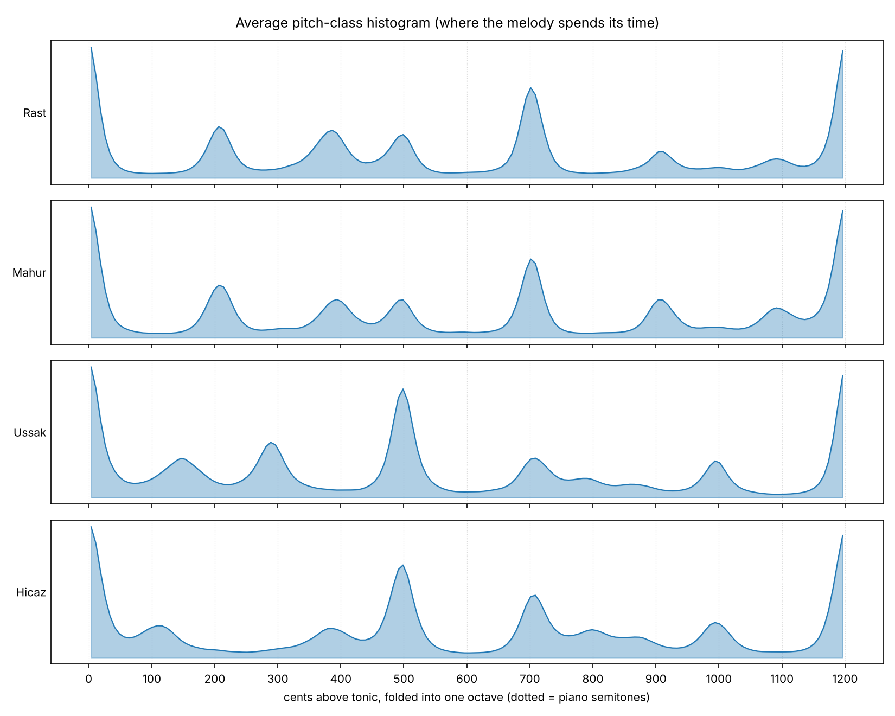
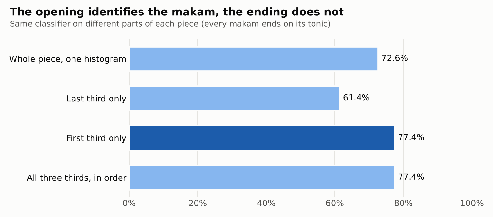
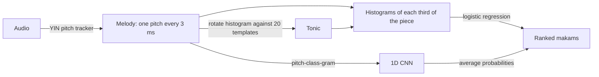

# Makam Recognition

<p align="center">
  
</p>

**Recognizing the melodic mode of Ottoman-Turkish music from the melody alone, and finding out which part of the melody gives it away.**


<p align="center">
  
</p>

## In 30 seconds

A **makam** is the melodic framework of a piece of Turkish classical music: a set of notes, many of
them *between* the keys of a piano, plus a typical path the melody follows (the *seyir*).
This project classifies 20 makams from 1000 recorded performances and asks a simple question:
**does the order of the notes matter, or only which notes are played?**

* A pitch histogram (which notes, how long) reproduces the published baseline: **73.0%** vs 71.8%
* Describing the beginning, middle and end separately raises it to **77.4%**, consistently over 3 random splits
* **The first third of a piece alone is as informative as the whole piece**, the last third is the least informative
* A 1D CNN alone overfits with 900 training recordings, but adds a small, consistent gain on top (**79.0%**)
* Tested on 1206 written scores of compositions it never heard, accuracy drops to 56%, and its confidence stops being reliable

## What a makam looks like

<p align="center">
  
</p>

Each curve shows where the melody spends its time, in cents above the tonic (100 cents = one piano key).
Many peaks fall **between** the dotted piano semitones: Rast's third sits at ar. 385 cents, Ussak's second
at ar. 150. Rounding pitches to the piano grid costs **16 points** of accuracy.
Rast and Mahur use almost the same notes, which is why order matters.

## The main finding: the opening gives it away

<p align="center">
  
</p>

The same classifier, fed histograms of different parts of each piece. The ending is the least useful part:
every makam resolves on its own tonic, so endings look alike once pitches are measured from the tonic.
The opening, where the melody first lays out the makam's notes, carries as much information as the whole piece.
The largest gains are on the makams a plain histogram confuses most (Ussak 44% to 62%, Muhayyer 56% to 72%).

## How it works



1. **Melody.** The dataset provides melody pitch tracks; for new audio, a numpy implementation of YIN extracts one (error under 0.1 cent on synthetic audio)
2. **Tonic.** Without a known tonic, the melody's pitch histogram is rotated around the octave against each makam's template; the best match gives the tonic (96.1% within 25 cents)
3. **Makam.** Pitch histograms of each third of the piece, measured from the tonic, go into a logistic regression; a small CNN reading the melody in time order can be averaged in

## How the results were checked

* **No leakage between recordings of the same song.** 267 recordings share a composition with another one; cross-validation keeps every composition on one side of the split (union-find over MusicBrainz work ids)
* **Seeds, not single runs.** Every claimed gain was repeated on 3 random splits; differences under ar. 2 points are treated as noise
* **Nested cross-validation.** Regularization is chosen inside each training fold; CNN hyperparameters were fixed before testing
* **Diagnosis before tuning.** The CNN's weak first result was traced to a train/test mismatch (3.7 points) and overfitting (more epochs raised training accuracy, not test accuracy) instead of being tuned blindly
* **Out-of-domain test.** 1206 SymbTr scores of compositions absent from the recordings (248 overlapping ones removed)
* **55 unit tests**, one command per figure and table

## Trained on performances, tested on scores

| | Unseen scores | Recordings (CV) |
|---|---|---|
| Tonic found | 80.5% | 96.1% |
| Makam, tonic given | 69.2% | 77.4% |
| Makam, tonic unknown | 55.7% (balanced 60.3%) | ar. 67% |

Two separate failure modes: for Hicaz the tonic is placed a fourth too high (the makam is right 94% of the
time once the tonic is given), while pairs that share a scale (Nihavent / Sultaniyegah, Ussak / Muhayyer)
fail even with the right tonic. Notated and performed pitches differ by less than 10 cents for these makams,
so the cues the model relies on are probably performance habits that scores do not contain.
On scores, predictions made with more than 95% confidence are right only 73% of the time (100% on recordings):
**confidence measured in one domain does not transfer to another.**

## Try it

```bash
git clone https://github.com/MTG/otmm_makam_recognition_dataset.git ../otmm_makam_recognition_dataset
git clone https://github.com/MTG/SymbTr.git ../SymbTr
python3 -m venv .venv && source .venv/bin/activate
pip install -e ".[dev]"
pytest -q
python scripts/m5_demo.py --data ../otmm_makam_recognition_dataset --symbtr ../SymbTr --makam Saba
```

The demo picks a score the model has never seen, synthesizes it to `demo/<name>.wav` (listen to it),
extracts the melody from the audio and recognizes it:

```
Tonic     : true 276.7 Hz, estimated 276.8 Hz (right, off by +0 cents, octave ignored)
True makam: Saba
Ranking   :
  1. Saba             100.0%  <- true
  2. Beyati             0.0%
  3. Huseyni            0.0%
```

Every experiment has its own script; the full list of commands and all results are in
[docs/RESULTS.md](docs/RESULTS.md). The CNN needs `pip install -e ".[dl]"` (PyTorch, runs on Apple MPS).

<details>
<summary><b>Repository layout</b></summary>

```
src/makam/data.py       load annotations, metadata and pitch tracks
src/makam/features.py   Hz -> cents, octave folding, pitch histograms
src/makam/classify.py   distances, kNN, nearest template, logistic regression
src/makam/evaluate.py   composition groups, stratified and grouped cross-validation
src/makam/tonic.py      tonic estimation by rotating histograms against templates
src/makam/sequence.py   pitch-class-gram: the melody as a (pitch x time) array
src/makam/cnn.py        1D CNN and its training loop (PyTorch)
src/makam/symbtr.py     read SymbTr scores, turn them into pitch tracks or audio
src/makam/pitch.py      YIN pitch tracker
src/makam/pipeline.py   recognizer: melody in, tonic and ranked makams out
scripts/m1_explore.py ... m5_demo.py   one script per milestone
scripts/make_readme_figures.py         the two charts on this page
tests/                  unit tests
docs/RESULTS.md         every experiment and number
```
</details>

## Limitations

* One benchmark: 1000 recordings, 20 makams, melody tracks only (the audio is not distributed)
* The annotated tonic is an octave away from the melody in ar. 25% of recordings; folded features are immune, others normalize the octave
* Scores are synthesized with exact pitches, without ornaments or vibrato
* The demo has not yet been run on real recorded audio

## Data and credits

* **OTMM Makam Recognition Dataset**: Karakurt, A., Şentürk, S., Serra, X. (2016). *MORTY: A Toolbox for Mode Recognition and Tonic Identification.* DLfM. CC BY-NC-SA 4.0
* **SymbTr**: Karaosmanoğlu, M. K. (2012). *A Turkish Makam Music Symbolic Database for Music Information Retrieval: SymbTr.* ISMIR. CC BY-NC-SA 4.0
* **YIN**: de Cheveigné, A., Kawahara, H. (2002). *YIN, a fundamental frequency estimator for speech and music.* JASA

Neither dataset is included in this repository; both are cloned next to it.
